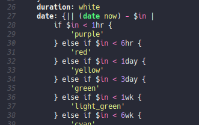

# Nushell Tree-Sitter mode

[](http://www.gnu.org/licenses/gpl-3.0.txt)

A mode for Nushell that uses tree-sitter.

* https://www.nushell.sh/
* https://github.com/nushell/tree-sitter-nu
* https://tree-sitter.github.io/tree-sitter/


## Features

* Syntax highlighting
* Indentation




## Installation

### Build tree-sitter-nu

1. Run `treesit-install-language-grammar`
2. Select "nu"
3. Use URL https://github.com/nushell/tree-sitter-nu
4. Pick "src"


### Install package

You will need to clone the repo and load it manually or use whatever package manger you use.

```emacs-lisp
(straight-use-package
 '(nushell-ts-mode :type git :host github :repo "herbertjones/nushell-ts-mode"))
```
